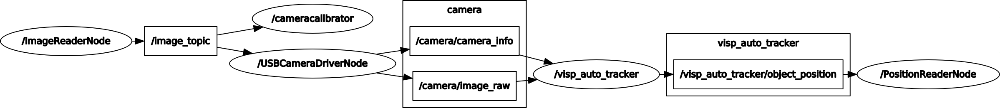
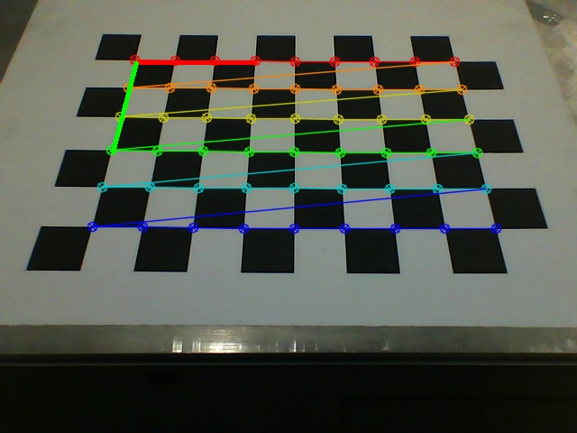
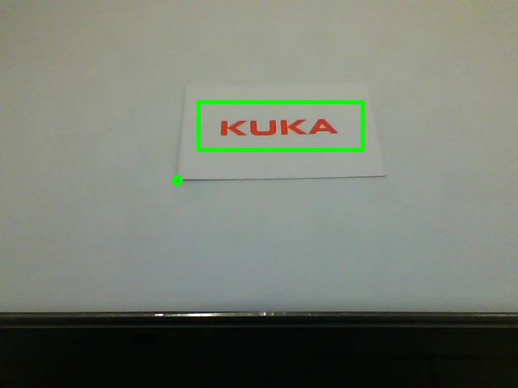

# ROS_iiwa_Demo
set up a framework, and enable the iiwa to track a moving target

use case 1: camera mounted on the flange, the TCP will following a moving target, which carries a pre-defined feature, e.g. a toy train

## setup environments:
- sudo apt-get update
- sudo apt-get upgrade
- sudo apt-get install libvisp-dev visp-images-data ros-kinetic-visp ros-kinetic-vision-visp ros-kinetic-camera-info-manager ros-kinetic-camera-info-manager-py ros-kinetic-camera-calibration python-catkin-tools

## run steps:
- cd {ROS_iiwa_Demo_folder}
- rosdep install --from-paths src --ignore-src -r -y
- catkin build
- source {ROS_iiwa_Demo_folder}/devel/setup.bash
- roslaunch opencv openCV.launch 
- rosrun camera_calibration cameracalibrator.py --size 8x6 --square 0.0138 image:=/image_topic camera:=/camera
- roslaunch iiwa_tool_examples iiwa_tool_command_moveit.launch 

A valid QR-code pattern that can be downloaded: https://github.com/lagadic/vision_visp/releases/download/vision_visp-0.5.0/template-qr-code.pdf

A Checkerborad example can be downloaded: http://wiki.ros.org/camera_calibration/Tutorials/MonocularCalibration?action=AttachFile&do=get&target=check-108.pdf

## nodes graph:

# Vision Station
The vision station uses usb camera on the laptop. Make sure it works well. For vision station application, three steps are needed. They are calibrate, train and match.

## Setup
 - cd {ROS_iiwa_Demo_folder}
 - catkin_make
 - source {ROS_iiwa_Demo_folder}/devel/setup.bash
 - roscore

## Calibrate
 - place a chessboard under the camera
 - rosrun vision_station vision_station_server.py 1
 - you will be asked to enter w, h and size and enter these parameters according to the chessboard
 - you will see a calibrated chessboard
 - an x-y coordinate system is shown in the chessboard (x axis is shown as red line and y axis is shown as green line)
 - press 's' to save the result or other key to discard

## Train
 - place the template object under the camera
 - rosrun vision_station vision_station_server.py 2
 - you will see a image of the object
 - left click and drag the mouse to draw a rectangle ROI to cover the object
 - middle click to select the origin of the object
 - you can select again by repeating the above two steps
 - press 's' to save the result or other key to discard

## Match
 - place the object you want to check under the camera
 - rosrun vision_station vision_station_server.py 4
 - in another terminator and run rosrun vision_station vision_station_client.py
 - after the calculation, you will get the message of format Pose2D