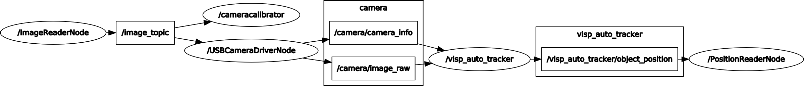

# Visual Tracking

## run steps:
- roslaunch opencv openCV.launch
- rosrun camera_calibration cameracalibrator.py --size 8x6 --square 0.0138 image:=/image_topic camera:=/camera
- roslaunch opencv moveit.launch

A valid QR-code pattern that can be downloaded: https://github.com/lagadic/vision_visp/releases/download/vision_visp-0.5.0/template-qr-code.pdf

A Checkerborad example can be downloaded: http://wiki.ros.org/camera_calibration/Tutorials/MonocularCalibration?action=AttachFile&do=get&target=check-108.pdf

## nodes graph:

