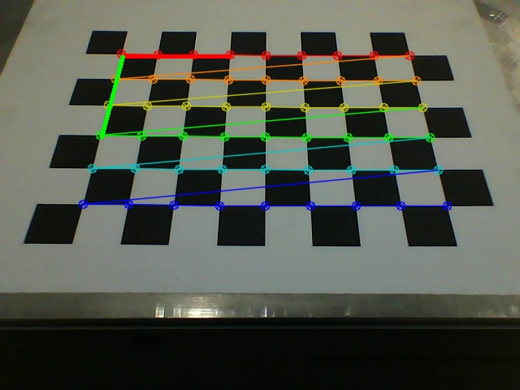
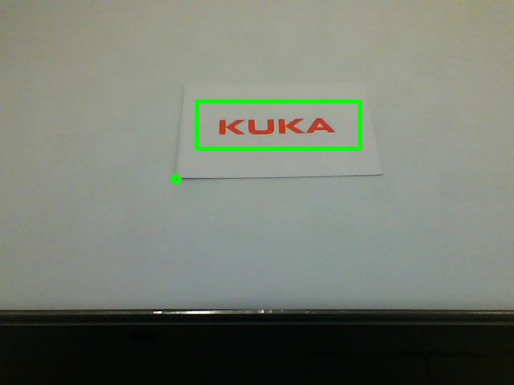

# Vision Station
The vision station uses usb camera on the laptop. Make sure it works well. For vision station application, three steps are needed. They are calibrate, train and match.

## Setup
 - roscore

## Calibrate
 - place a chessboard under the camera
 - rosrun vision_station vision_station_server.py 1
 - you will be asked to enter w, h and size and enter these parameters according to the chessboard
 - you will see a calibrated chessboard
 - an x-y coordinate system is shown in the chessboard (x axis is shown as red line and y axis is shown as green line)
 - press 's' to save the result or other key to discard

## Train
 - place the template object under the camera
 - rosrun vision_station vision_station_server.py 2
 - you will see a image of the object
 - left click and drag the mouse to draw a rectangle ROI to cover the object
 - middle click to select the origin of the object
 - you can select again by repeating the above two steps
 - press 's' to save the result or other key to discard

## Match
 - place the object you want to check under the camera
 - rosrun vision_station vision_station_server.py 4
 - in another terminator and run rosrun vision_station vision_station_client.py
 - after the calculation, you will get the message of format Pose2D
